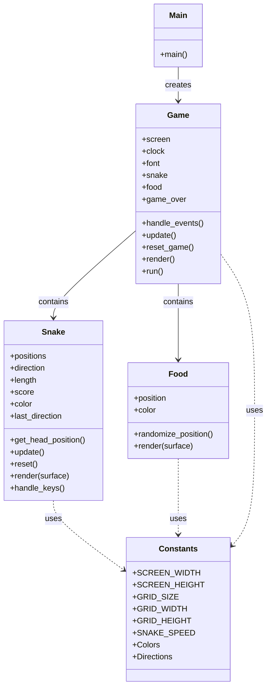

# Python Snake Game

A classic Snake game implementation using the Pygame library. This project demonstrates fundamental game development concepts including game loops, collision detection, user input handling, and simple graphics rendering.


## Project Structure



## Features

- **Snake Movement**: Control the snake using arrow keys
- **Food Collection**: Randomly appearing food that makes the snake grow when eaten
- **Collision Detection**: Game over when the snake hits itself
- **Score Tracking**: Real-time score display in the top-left corner
- **Game Loop**: Proper frame rate control for consistent gameplay
- **Restart Functionality**: Press Enter to restart after game over

## Requirements

- Python 3.x
- Pygame library

## Installation

1. Clone this repository or download the source code:
   ```
   git clone https://github.com/yourusername/snake-game.git
   cd snake-game
   ```

2. Install the required dependencies:
   ```
   pip install pygame
   ```

## How to Play

1. Run the game:
   ```
   python main.py
   ```

2. Controls:
   - **Arrow Keys**: Control the snake's direction
   - **Escape**: Quit the game
   - **Enter**: Restart after game over

3. Gameplay:
   - The snake starts in the center of the screen
   - Eat the red food to grow and increase your score
   - Avoid hitting the snake's own body
   - The game ends when the snake collides with itself

## Code Structure

The game is organized into three main classes:

- **Snake**: Handles snake movement, growth, and rendering
- **Food**: Manages food placement and rendering
- **Game**: Controls the main game loop, event handling, and overall game state

## Customization

You can modify the following constants in the `constants.py` file to customize the game:

- `SCREEN_WIDTH` and `SCREEN_HEIGHT`: Change the window size
- `GRID_SIZE`: Adjust the size of the snake and food blocks
- `SNAKE_SPEED`: Modify the game speed (frames per second)
- Color constants: Customize the appearance of the game elements

## Future Enhancements

Potential improvements for future versions:

- Add sound effects
- Implement different difficulty levels
- Create a high score system
- Add obstacles or walls
- Implement power-ups
- Add a start menu

## License

This project is licensed under the MIT License - see the LICENSE file for details.

## Acknowledgments

- Inspired by the classic Snake game
- Built with [Pygame](https://www.pygame.org/)
